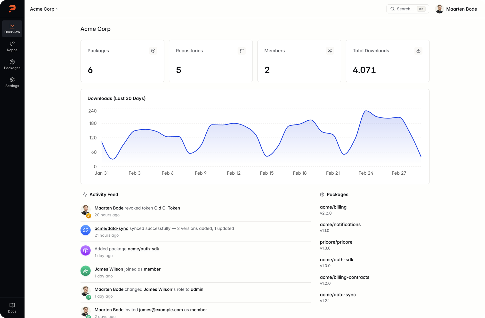

<p align="center"></p>

<p align="center">
<a href="https://github.com/pricorephp/pricore/actions/workflows/lint.yml"></a>
<a href="https://github.com/pricorephp/pricore/actions/workflows/tests.yml"></a>
<a href="https://github.com/pricorephp/pricore/blob/main/LICENSE"></a>
</p>

<p align="center">
<strong>A private Composer registry you can depend on.</strong><br>
Fast, self-hosted, and built for PHP teams who are tired of fragile workarounds.<br>
Manage your packages with a registry that just works.
</p>

<p align="center">
<a href="https://pricore.dev">Website</a> · <a href="https://docs.pricore.dev">Documentation</a> · <a href="https://app.pricore.dev">Hosted Pricore</a>
</p>

<p align="center">

</p>

---

## About Pricore

Managing private PHP packages should be simple. Pricore makes it that way. It provides a centralized, reliable way to store package metadata, control access with tokens, and integrate seamlessly with Git-based workflows.

With Pricore, teams gain full ownership of their package ecosystem while keeping dependency management fast, consistent, and transparent.

Don't want to self-host? Try [Hosted Pricore](https://app.pricore.dev) — a fully managed registry with zero setup.

### Why Pricore?

- **Stay in control** - Keep your private packages on your own infrastructure. No third-party servers, no external dependencies.
- **Skip the manual work** - Webhook-driven updates, a web dashboard, and full Composer v2 API support. Out of the box.
- **Use what you know** - Built on Laravel. If your team already knows the stack, you can run, extend, and contribute to Pricore from day one.

## Features

- **Private & Secure** - Token-based auth, per-package access control. Your code stays yours.
- **Git-Based Mirroring** - Point Pricore at any Git repo. It mirrors, indexes, and serves automatically.
- **Built on Laravel** - Familiar stack, easy to extend. If you know Laravel, you know Pricore.
- **Blazing Fast** - Packages resolve in milliseconds. No waiting on external APIs.
- **Web Dashboard** - Browse packages, manage tokens, and view download stats from a clean UI.
- **Webhook Support** - Auto-update packages when you push. Works with GitHub, GitLab, and Bitbucket.
- **Composer v2 Native** - Full Composer v2 API support including metadata-url for lightning-fast resolves.
- **Open Source** - Apache 2.0 licensed. Run it, fork it, contribute to it. No vendor lock-in, ever.

## Quick Start with Docker

60 seconds to a working registry. Three commands. That's all it takes.

**1. Download the compose file**

```bash
curl -o docker-compose.yml https://raw.githubusercontent.com/pricorephp/pricore/main/docker-compose.yml
```

**2. Start the application**

Migrations and setup run automatically on first boot.

```bash
docker compose up -d
```

**3. Create your first user**

Then open `http://localhost:8000` and start adding packages.

```bash
docker compose exec app php artisan pricore:install
```

> The entrypoint automatically generates an `APP_KEY`, creates the SQLite database, runs migrations, and caches configuration on first boot. For production, you can provide your own `APP_KEY` via environment variable.

For manual installation, configuration, and production deployment guides, see the [documentation](https://docs.pricore.dev).

## Contributing

We welcome contributions! See [CONTRIBUTING.md](CONTRIBUTING.md) for development setup, guidelines, and how to get started.

## Security

If you discover a security vulnerability, please send an email to pricore@maartenbode.com instead of using the issue tracker. All security vulnerabilities will be promptly addressed.

## License

Pricore is open-source software licensed under the [Apache License 2.0](LICENSE).

---

<p align="center">
Made with 💚 for the PHP community
</p>
